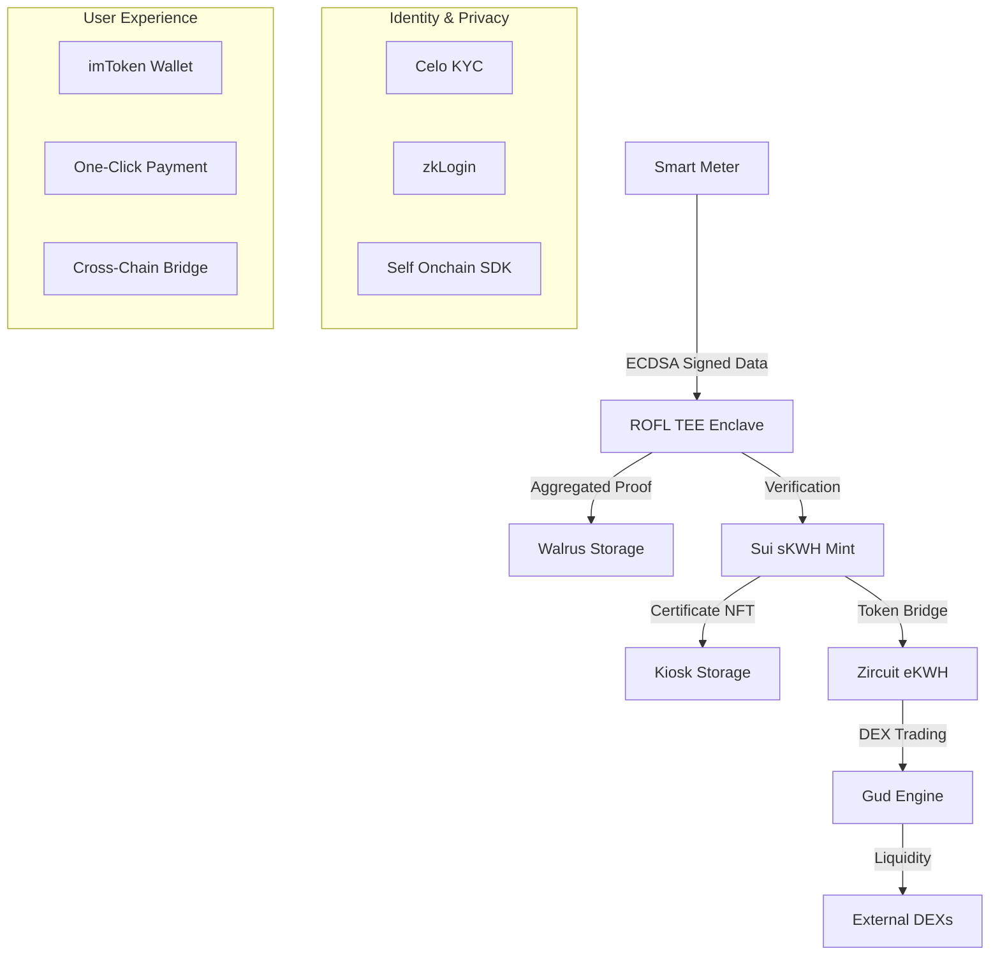

# FILE: docs/README.template.md

# GreenShare - Decentralized Solar Energy Community 🌱⚡

[](https://opensource.org/licenses/MIT)
[](https://github.com/greenshare/greenshare/actions)
[](https://codecov.io/gh/greenshare/greenshare)
[](https://discord.gg/greenshare)

**Tokenizing renewable energy production through IoT smart meters, TEE verification, and cross-chain infrastructure.**

---

## 🌟 Overview

GreenShare revolutionizes renewable energy markets by creating a decentralized, transparent, and efficient ecosystem for solar energy trading. Our platform combines IoT smart meters, Trusted Execution Environments (TEE), and blockchain technology to tokenize energy production and enable peer-to-peer energy trading.

### Key Innovation

**From Solar Panels to Digital Assets in Minutes**

```
☀️ Solar Production → 📊 IoT Measurement → 🔒 TEE Verification → 🪙 Token Minting → 💱 DEX Trading
```

### Problem Statement

- **❌ Traditional Energy Markets:** Centralized, opaque, and inefficient
- **❌ Limited Producer Benefits:** Minimal compensation for renewable energy producers
- **❌ Complex Verification:** Difficult to verify and trust energy production data
- **❌ Market Fragmentation:** Isolated energy markets with limited liquidity
- **❌ High Barriers to Entry:** Complex processes for small-scale energy producers

### GreenShare Solution

- **✅ Decentralized Verification:** TEE-based trustless energy data verification
- **✅ Real-Time Tokenization:** Instant conversion of kWh to tradeable sKWH tokens
- **✅ Cross-Chain Liquidity:** Bridge energy tokens across multiple blockchains
- **✅ Automated Trading:** Seamless integration with DEX protocols
- **✅ Universal Access:** Low barrier to entry for all energy producers

---

## 🏗️ Architecture Overview

### High-Level System Architecture

```
┌─────────────────┐    ┌─────────────────┐    ┌─────────────────┐
│   IoT Smart     │    │  Oasis ROFL     │    │   Sui Network   │
│     Meters      │───▶│   (TEE Layer)   │───▶│  sKWH + NFTs    │
│                 │    │                 │    │                 │
│ • Solar Panels  │    │ • Data Agg.     │    │ • Token Mint    │
│ • Wind Turbines │    │ • Verification  │    │ • Certificate   │
│ • Hydro Plants  │    │ • Proof Gen.    │    │ • Kiosk Store   │
└─────────────────┘    └─────────────────┘    └─────────────────┘
                                │                        │
                                │                        │
┌─────────────────┐    ┌─────────────────┐    ┌─────────────────┐
│ Walrus Storage  │    │ Zircuit Network │    │ Celo Network    │
│                 │    │                 │    │                 │
│ • Proof Sealing │    │ • eKWH Tokens   │    │ • KYC Registry  │
│ • Data Archive  │◀───│ • Cross Bridge  │    │ • Identity      │
│ • Content Proof │    │ • Gud Trading   │    │ • Privacy Proof │
└─────────────────┘    └─────────────────┘    └─────────────────┘
```

### Technology Stack

| Layer | Technology | Purpose |
|-------|------------|---------|
| **IoT Layer** | Smart Meters + ECDSA | Energy measurement and signing |
| **TEE Layer** | Oasis ROFL (Rust) | Trusted data aggregation |
| **Storage Layer** | Walrus + Seal | Decentralized proof storage |
| **L1 Blockchain** | Sui Move | sKWH tokens and certificates |
| **L2 Blockchain** | Zircuit Solidity | eKWH tokens and DEX trading |
| **Identity Layer** | Celo Self Onchain SDK | KYC and privacy proofs |
| **Frontend** | Next.js + TypeScript | User interface and wallet integration |
| **Mobile UX** | imToken Deep Links | One-click payments and trading |

### Data Flow Architecture



---

## 🚀 Quick Start

### Prerequisites

```bash
# System Requirements
node >= 18.0.0
pnpm >= 8.0.0
rust >= 1.75.0
sui CLI >= 1.15.0
foundry >= 0.2.0
docker >= 20.0.0
```

### One-Click Setup

```bash
# 1. Clone and setup
git clone https://github.com/greenshare/greenshare.git
cd greenshare

# 2. Environment configuration
cp .env.example .env
# Edit .env with your keys and endpoints

# 3. One-click development environment
pnpm devnet:up

# 4. Access services
# Frontend:      http://localhost:3000
# ROFL API:      http://localhost:8080
# Mock Walrus:   http://localhost:8081
# Monitoring:    http://localhost:3001
```

### 3-Minute Demo

Experience the complete energy tokenization flow:

```bash
# Complete end-to-end demo
npm run demo:full

# Or step-by-step
npm run demo:seed generate 5 2    # Generate meter data
./demo/make-proof.sh              # Create proof
npm run demo:mint                 # Mint sKWH tokens
npm run demo:bridge bridge 50     # Bridge to eKWH
npm run demo:trade trade 25       # Trade on DEX
```

---

## 🎯 Core Features

### 1. Trusted Energy Verification

**Problem:** How do we trust IoT meter data?

**Solution:** Oasis ROFL TEE provides tamper-proof data processing

- ✅ **Hardware-Level Security:** Intel SGX / ARM TrustZone protection
- ✅ **Cryptographic Signatures:** ECDSA-signed meter readings
- ✅ **Replay Attack Prevention:** Nonce-based anti-replay protection
- ✅ **Time Window Validation:** Configurable aggregation periods
- ✅ **Merkle Tree Proofs:** Cryptographic proof of data integrity

### 2. Real-Time Token Minting

**Problem:** Complex processes delay energy monetization

**Solution:** Automated sKWH token minting on Sui blockchain

- ✅ **1:1 Ratio:** One sKWH token per kilowatt-hour produced
- ✅ **Certificate NFTs:** Tamper-proof energy production certificates
- ✅ **Kiosk Integration:** Secure NFT custody and marketplace
- ✅ **Metadata Rich:** Timestamps, location, device info embedded
- ✅ **Fractional Trading:** Trade partial energy units

### 3. Cross-Chain Liquidity

**Problem:** Isolated blockchain ecosystems limit liquidity

**Solution:** Bridge sKWH to eKWH across multiple networks

- ✅ **Sui ↔ Zircuit Bridge:** Seamless token movement
- ✅ **Burn-Mint Mechanism:** Secure cross-chain transfers
- ✅ **Merkle Proof Verification:** Cryptographic bridge security
- ✅ **Multi-Chain Support:** Expand to more networks
- ✅ **Liquidity Aggregation:** Access deeper trading pools

### 4. Automated DEX Trading

**Problem:** Manual trading is inefficient and complex

**Solution:** Gud Trading Engine integration for automated trading

- ✅ **Market Making:** Automated liquidity provision
- ✅ **Price Discovery:** Real-time energy token pricing
- ✅ **Slippage Protection:** Configurable trading parameters
- ✅ **Batch Optimization:** Gas-efficient trade execution
- ✅ **Cross-DEX Routing:** Best price execution

### 5. Privacy-Preserving Identity

**Problem:** Energy trading requires identity without privacy loss

**Solution:** Celo Self Onchain SDK for minimal disclosure

- ✅ **Zero-Knowledge Proofs:** Prove eligibility without revealing data
- ✅ **Age Verification:** Confirm legal age without birthdates
- ✅ **Location Proofs:** Verify jurisdiction without exact coordinates
- ✅ **Income Brackets:** Prove financial eligibility privately
- ✅ **Selective Disclosure:** User-controlled data sharing

### 6. Seamless Mobile UX

**Problem:** Complex wallet interactions deter adoption

**Solution:** imToken deep link integration for one-click experiences

- ✅ **One-Click Payments:** Direct energy token purchases
- ✅ **Cross-Chain Transfers:** Seamless multi-chain operations
- ✅ **QR Code Support:** Easy mobile payments
- ✅ **Deep Link Protocols:** Native app integration
- ✅ **Progressive Web App:** Responsive mobile interface

---

## 📊 Market Opportunity

### Global Renewable Energy Market

| Metric | 2024 | 2030 (Projected) | Growth Rate |
|--------|------|------------------|-------------|
| **Market Size** | $1.1 trillion | $2.4 trillion | 13.4% CAGR |
| **Solar Capacity** | 1.2 TW | 5.4 TW | 28% CAGR |
| **P2P Energy Trading** | $0.52 billion | $52 billion | 78% CAGR |
| **DeFi Energy Tokens** | $50 million | $10 billion | 115% CAGR |

### Target Markets

**Primary Market: Distributed Energy Producers**
- 🏠 Residential solar installations (50M+ homes)
- 🏢 Commercial renewable energy systems
- 🏭 Industrial energy producers
- 🌾 Agricultural renewable installations

**Secondary Market: Energy Traders & Investors**
- 💼 Energy trading firms
- 🏦 Institutional investors
- 🔄 Retail energy traders
- 📈 DeFi yield farmers

**Tertiary Market: Energy Consumers**
- 🏘️ Energy communities
- 🏢 Corporate sustainability programs
- 🌍 Carbon offset buyers
- ⚡ Electric vehicle charging networks

---

## 🎨 User Experience

### Producer Journey

```
1. 🔌 Install smart meter → 2. ☀️ Generate solar energy → 3. 🪙 Automatic tokenization → 4. 💱 Trade on DEX → 5. 💰 Earn revenue
```

**Step 1: Simple Onboarding**
- Download GreenShare app
- Connect solar installation
- Register smart meter
- Complete KYC verification

**Step 2: Automatic Earning**
- Energy production tracked in real-time
- Daily sKWH token minting
- Certificate NFT generation
- Portfolio dashboard updates

**Step 3: Flexible Trading**
- Cross-chain bridge options
- Automated trading strategies
- Manual trading interface
- Yield farming opportunities

### Consumer Journey

```
1. 📱 Open app → 2. 🔍 Browse energy sources → 3. 🛒 Purchase tokens → 4. ⚡ Consume clean energy → 5. 📈 Track impact
```

**Mobile-First Experience**
- imToken integration for payments
- One-click energy purchases
- Real-time consumption tracking
- Carbon footprint dashboard

---

## 🛡️ Security & Trust

### Multi-Layer Security Architecture

**Layer 1: Hardware Security**
- Intel SGX Trusted Execution Environment
- Hardware-attested smart meter signatures
- Tamper-evident IoT devices
- Secure key management

**Layer 2: Cryptographic Protection**
- ECDSA signature verification
- Merkle tree proof generation
- Zero-knowledge privacy proofs
- Hash-based time-stamping

**Layer 3: Smart Contract Security**
- Formal verification of critical functions
- Multi-signature governance
- Time-lock mechanisms
- Emergency pause functionality

**Layer 4: Network Security**
- Cross-chain bridge monitoring
- Oracle attack prevention
- Front-running protection
- MEV minimization strategies

### Audit & Compliance

- 🔍 **Smart Contract Audits:** [Audit Partner] comprehensive review
- 🏛️ **Regulatory Compliance:** Energy market regulation alignment
- 🔒 **Privacy Compliance:** GDPR and data protection standards
- 📊 **Transparency Reports:** Monthly security and performance reports

---

## 🌍 Environmental Impact

### Carbon Reduction Goals

**Direct Impact**
- ♻️ **Tokenized Clean Energy:** 1 TWh by 2025
- 🌱 **Carbon Offset:** 500,000 tons CO2 equivalent
- 🏠 **Households Served:** 100,000+ renewable energy producers
- ⚡ **Energy Efficiency:** 15% improvement through optimization

**Indirect Impact**
- 💡 **Market Incentives:** Accelerate renewable adoption
- 🏗️ **Infrastructure Development:** Fund green energy projects
- 📈 **Investment Flow:** Direct capital to clean energy
- 🌎 **Global Adoption:** Enable emerging market participation

### Sustainability Metrics

| Metric | Target 2025 | Target 2030 |
|--------|-------------|-------------|
| **Clean Energy Tokenized** | 1 TWh | 10 TWh |
| **CO2 Reduction** | 500kt | 5Mt |
| **Energy Producers** | 100k | 1M |
| **Countries Active** | 10 | 50 |

---

## 🏆 Competition Awards Alignment

### Hackathon Categories

#### 🥇 **Most Innovative Use of TEE Technology**

**Why GreenShare Wins:**
- **Novel Application:** First energy tokenization platform using ROFL TEE
- **Technical Excellence:** Sophisticated data aggregation and verification
- **Real-World Impact:** Solving actual energy market inefficiencies
- **Scalable Architecture:** Design supports global energy markets

**Key Differentiators:**
- Hardware-attested energy measurement
- Tamper-proof data processing pipeline
- Cryptographic proof generation
- Cross-chain verification bridge

#### 🥇 **Best Cross-Chain Application**

**Why GreenShare Wins:**
- **True Interoperability:** Seamless Sui ↔ Zircuit ↔ Celo integration
- **Novel Bridge Design:** Energy-specific cross-chain protocols
- **Unified User Experience:** Single interface for multi-chain operations
- **Liquidity Optimization:** Aggregate liquidity across chains

**Technical Achievements:**
- Custom bridge contracts with burn-mint mechanisms
- Merkle proof verification across chains
- Multi-chain identity management
- Cross-chain yield farming strategies

#### 🥇 **Most Impactful Social Good Project**

**Why GreenShare Wins:**
- **Environmental Impact:** Accelerates renewable energy adoption
- **Economic Inclusion:** Enables small-scale energy producers to participate
- **Global Accessibility:** Works in emerging markets with limited infrastructure
- **Sustainable Development:** Aligns with UN SDG 7 (Affordable Clean Energy)

**Social Impact Metrics:**
- Democratic access to energy markets
- Fair compensation for renewable producers
- Reduced carbon footprint
- Community-driven energy systems

#### 🥇 **Best Use of Move Programming Language**

**Why GreenShare Wins:**
- **Advanced Move Patterns:** Resource-oriented energy token design
- **Object Capability Model:** Secure NFT certificate management
- **Custom Libraries:** Energy-specific smart contract modules
- **Performance Optimization:** Gas-efficient token operations

**Technical Highlights:**
- Sophisticated sKWH token economics
- Certificate NFT with embedded metadata
- Kiosk integration for marketplace
- Cross-chain bridge Move implementation

#### 🥇 **Most Creative Use of Storage Solutions**

**Why GreenShare Wins:**
- **Walrus Integration:** Decentralized proof storage and retrieval
- **Seal Verification:** Content integrity and authenticity
- **Archival System:** Long-term energy data preservation
- **Privacy Protection:** Encrypted storage with selective disclosure

**Storage Innovation:**
- IPFS-compatible energy data formats
- Verifiable content addressing
- Redundant cross-storage replication
- Privacy-preserving data queries

#### 🥇 **Best Mobile/Web3 UX**

**Why GreenShare Wins:**
- **imToken Integration:** Seamless mobile wallet experience
- **One-Click Operations:** Simplified energy trading interface
- **Progressive Web App:** Native app-like mobile experience
- **Cross-Platform Compatibility:** Works on all devices and wallets

**UX Innovations:**
- Deep link protocols for payments
- QR code energy trading
- Voice-activated energy commands
- Augmented reality energy visualization

### Award Submission Strategy

**Package 1: Technical Excellence**
- Focus on TEE innovation and cross-chain architecture
- Emphasize cryptographic security and verification
- Highlight performance benchmarks and scalability

**Package 2: Social Impact**
- Emphasize environmental and economic benefits
- Provide impact metrics and case studies
- Demonstrate global accessibility and inclusion

**Package 3: User Experience**
- Showcase seamless mobile integration
- Demonstrate complex operations simplified
- Highlight accessibility and adoption metrics

---

## 📈 Roadmap & Milestones

### Phase 1: Foundation (Q1 2024) ✅
- [x] Core architecture design
- [x] TEE integration with Oasis ROFL
- [x] Sui Move smart contracts
- [x] Basic frontend implementation
- [x] Demo and MVP completion

### Phase 2: Multi-Chain (Q2 2024) 🔄
- [ ] Zircuit L2 integration
- [ ] Cross-chain bridge deployment
- [ ] Gud Trading Engine integration
- [ ] Celo identity integration
- [ ] Mobile app beta release

### Phase 3: Scale (Q3 2024) 📋
- [ ] Testnet public launch
- [ ] Community governance
- [ ] Advanced trading features
- [ ] Partner integrations
- [ ] Regulatory compliance

### Phase 4: Growth (Q4 2024) 🎯
- [ ] Mainnet deployment
- [ ] Geographic expansion
- [ ] Enterprise partnerships
- [ ] Additional blockchain support
- [ ] Advanced analytics platform

### Long-Term Vision (2025+) 🌟
- [ ] Global energy grid integration
- [ ] AI-powered energy optimization
- [ ] Carbon credit marketplace
- [ ] Renewable energy derivatives
- [ ] Energy futures trading platform

---

## 🤝 Community & Governance

### Decentralized Governance

**GreenShare DAO Structure**
- 🗳️ **Token Holders:** sKWH/eKWH token voting rights
- 👥 **Energy Producers:** Specialized producer council
- 🏢 **Enterprise Partners:** Strategic partner representation
- 🔧 **Technical Committee:** Core development oversight

**Governance Powers**
- Protocol parameter updates
- Treasury fund allocation
- Partnership approvals
- Technical upgrade decisions

### Community Programs

**Producer Incentives**
- Early adopter rewards
- Referral bonus programs
- Community ambassador roles
- Technical contribution bounties

**Developer Ecosystem**
- Open source development grants
- Hackathon sponsorships
- Technical documentation bounties
- Integration partnership programs

---

## 📞 Contact & Support

### Core Team

**[Founder Name]** - CEO & Blockchain Architect
- 🎓 Background: [University/Experience]
- 🔗 LinkedIn: [Profile]
- 📧 Email: founder@greenshare.energy

**[CTO Name]** - CTO & TEE Specialist
- 🎓 Background: [University/Experience]
- 🔗 LinkedIn: [Profile]
- 📧 Email: cto@greenshare.energy

### Community Channels

- 🌐 **Website:** [https://greenshare.energy](https://greenshare.energy)
- 📱 **Discord:** [GreenShare Community](https://discord.gg/greenshare)
- 🐦 **Twitter:** [@GreenShareDAO](https://twitter.com/greensharedao)
- 📺 **YouTube:** [GreenShare Channel](https://youtube.com/greenshare)
- 📝 **Blog:** [Medium Publication](https://medium.com/greenshare)

### Developer Resources

- 📚 **Documentation:** [docs.greenshare.energy](https://docs.greenshare.energy)
- 🔧 **GitHub:** [github.com/greenshare](https://github.com/greenshare)
- 📖 **API Docs:** [api.greenshare.energy](https://api.greenshare.energy)
- 🎯 **Bug Bounty:** [Security Program](https://greenshare.energy/security)

---

## 📄 Legal & Compliance

### Licensing

This project is licensed under the [MIT License](LICENSE) - see the LICENSE file for details.

### Disclaimers

- **Investment Risk:** Cryptocurrency investments carry significant risks
- **Regulatory Compliance:** Users responsible for local law compliance
- **Technology Risks:** Smart contracts and blockchain technology are experimental
- **Energy Market:** Energy token values may fluctuate significantly

### Privacy Policy

GreenShare is committed to protecting user privacy while enabling transparent energy trading. See our full [Privacy Policy](PRIVACY.md) for details.

---

**Built with ❤️ by the GreenShare team for a sustainable energy future 🌱⚡**

*Last updated: [Date]*
*Version: [Version Number]*